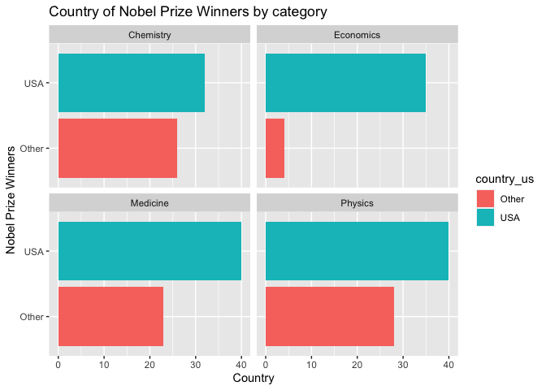
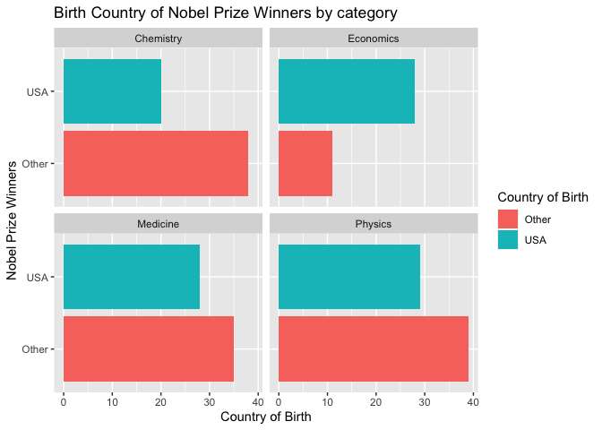

Lab 03 - Nobel laureates
================
Kyle Knaut
January 15th, 2024

### Load packages and data

``` r
library(tidyverse) 
```

``` r
nobel <- read_csv("data/nobel.csv")
```

## Exercises

### Exercise 1

``` r
# there are 935 observations in this dataset, which are represented by rows. These rows
# contain observations of 26 different variables which can be seen below
# the variables will be represented by collums in the dataframe

glimpse(nobel)
```

    ## Rows: 935
    ## Columns: 26
    ## $ id                    <dbl> 1, 2, 3, 4, 5, 6, 6, 8, 9, 10, 11, 12, 13, 14, 1…
    ## $ firstname             <chr> "Wilhelm Conrad", "Hendrik A.", "Pieter", "Henri…
    ## $ surname               <chr> "Röntgen", "Lorentz", "Zeeman", "Becquerel", "Cu…
    ## $ year                  <dbl> 1901, 1902, 1902, 1903, 1903, 1903, 1911, 1904, …
    ## $ category              <chr> "Physics", "Physics", "Physics", "Physics", "Phy…
    ## $ affiliation           <chr> "Munich University", "Leiden University", "Amste…
    ## $ city                  <chr> "Munich", "Leiden", "Amsterdam", "Paris", "Paris…
    ## $ country               <chr> "Germany", "Netherlands", "Netherlands", "France…
    ## $ born_date             <date> 1845-03-27, 1853-07-18, 1865-05-25, 1852-12-15,…
    ## $ died_date             <date> 1923-02-10, 1928-02-04, 1943-10-09, 1908-08-25,…
    ## $ gender                <chr> "male", "male", "male", "male", "male", "female"…
    ## $ born_city             <chr> "Remscheid", "Arnhem", "Zonnemaire", "Paris", "P…
    ## $ born_country          <chr> "Germany", "Netherlands", "Netherlands", "France…
    ## $ born_country_code     <chr> "DE", "NL", "NL", "FR", "FR", "PL", "PL", "GB", …
    ## $ died_city             <chr> "Munich", NA, "Amsterdam", NA, "Paris", "Sallanc…
    ## $ died_country          <chr> "Germany", "Netherlands", "Netherlands", "France…
    ## $ died_country_code     <chr> "DE", "NL", "NL", "FR", "FR", "FR", "FR", "GB", …
    ## $ overall_motivation    <chr> NA, NA, NA, NA, NA, NA, NA, NA, NA, NA, NA, NA, …
    ## $ share                 <dbl> 1, 2, 2, 2, 4, 4, 1, 1, 1, 1, 1, 1, 2, 2, 1, 1, …
    ## $ motivation            <chr> "\"in recognition of the extraordinary services …
    ## $ born_country_original <chr> "Prussia (now Germany)", "the Netherlands", "the…
    ## $ born_city_original    <chr> "Lennep (now Remscheid)", "Arnhem", "Zonnemaire"…
    ## $ died_country_original <chr> "Germany", "the Netherlands", "the Netherlands",…
    ## $ died_city_original    <chr> "Munich", NA, "Amsterdam", NA, "Paris", "Sallanc…
    ## $ city_original         <chr> "Munich", "Leiden", "Amsterdam", "Paris", "Paris…
    ## $ country_original      <chr> "Germany", "the Netherlands", "the Netherlands",…

### Exercise 2

``` r
#nobel_living4 = filter(nobel, gender!="org" & country!='NA')

nobel_living <- nobel %>% 
  filter(gender != "org") %>%
  filter(!is.na(country)) %>% #filter(country != 'NA') %>%
  filter(is.na(died_date))

                      
#Watched a video on the channel Mike Jonas Econometricts to try to figure this out, it kinda 
#helped but the biggest problem is still filtering out dead winners. When I try to filter for 
#died_date = NA, no matter whether I use quotations, single quotes, or any attempt to use the NA 
#value, it always leaves me with zero observations, which tells me it doesnt like the syntax that
#Im trying to use to say there is no value for died_date
  
#glimpse(nobel_living4)
```

### Exercise 3

``` r
nobel_living <- nobel_living %>%
  mutate(country_us = if_else(country == "USA", "USA", "Other"))
```

### Exercise 4

``` r
nobel_living_science <- nobel_living %>%
  filter(category %in% c("Physics", "Medicine", "Chemistry", "Economics"))

#This is a new dataframe that is limited to
#observations of Physics, Medicine, Chemistry
# and Economics
```

### Exercise 5

``` r
ggplot(nobel_living_science, aes(x = country_us, fill = country_us)) + geom_bar() + coord_flip() + labs( x = "Nobel Prize Winners", y = "Country", title = "Country of Nobel Prize Winners by category") + facet_wrap(~ category)
```

<!-- -->

``` r
#Faceted bar graphs of where each nobel prize winner is from
```

…

### Exercise 6

``` r
nobel_living_science <- nobel_living %>%
  mutate(born_country_us = if_else(born_country == "USA", "USA", "Other")) 

ggplot(nobel_living_science, aes(x = born_country_us, fill = born_country_us)) + geom_bar() + coord_flip() + labs( x = "Nobel Prize Winners", y = "Country of Birth", title = "Birth Country of Nobel Prize Winners by category", fill = "Country of Birth") + facet_wrap(~ category)
```

<!-- --> …

### Exercise 7
