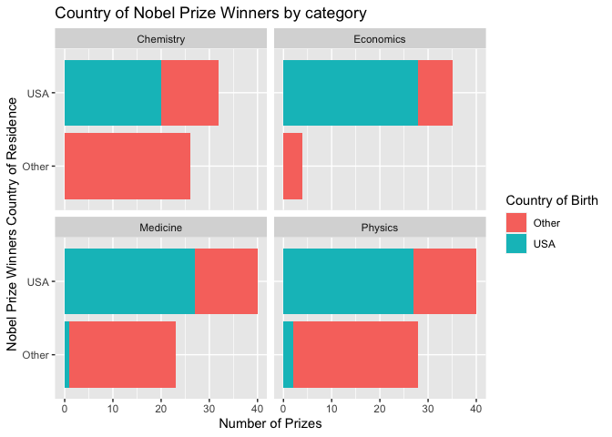

Lab 03 - Nobel laureates
================
Kyle Knaut
January 15th, 2024

### Load packages and data

``` r
library(tidyverse) 
```

``` r
nobel <- read_csv("data/nobel.csv")
```

## Exercises

### Exercise 1

``` r
# there are 935 observations in this dataset, which are represented by rows. These rows
# contain observations of 26 different variables which can be seen below
# the variables will be represented by collums in the dataframe

glimpse(nobel)
```

    ## Rows: 935
    ## Columns: 26
    ## $ id                    <dbl> 1, 2, 3, 4, 5, 6, 6, 8, 9, 10, 11, 12, 13, 14, 1…
    ## $ firstname             <chr> "Wilhelm Conrad", "Hendrik A.", "Pieter", "Henri…
    ## $ surname               <chr> "Röntgen", "Lorentz", "Zeeman", "Becquerel", "Cu…
    ## $ year                  <dbl> 1901, 1902, 1902, 1903, 1903, 1903, 1911, 1904, …
    ## $ category              <chr> "Physics", "Physics", "Physics", "Physics", "Phy…
    ## $ affiliation           <chr> "Munich University", "Leiden University", "Amste…
    ## $ city                  <chr> "Munich", "Leiden", "Amsterdam", "Paris", "Paris…
    ## $ country               <chr> "Germany", "Netherlands", "Netherlands", "France…
    ## $ born_date             <date> 1845-03-27, 1853-07-18, 1865-05-25, 1852-12-15,…
    ## $ died_date             <date> 1923-02-10, 1928-02-04, 1943-10-09, 1908-08-25,…
    ## $ gender                <chr> "male", "male", "male", "male", "male", "female"…
    ## $ born_city             <chr> "Remscheid", "Arnhem", "Zonnemaire", "Paris", "P…
    ## $ born_country          <chr> "Germany", "Netherlands", "Netherlands", "France…
    ## $ born_country_code     <chr> "DE", "NL", "NL", "FR", "FR", "PL", "PL", "GB", …
    ## $ died_city             <chr> "Munich", NA, "Amsterdam", NA, "Paris", "Sallanc…
    ## $ died_country          <chr> "Germany", "Netherlands", "Netherlands", "France…
    ## $ died_country_code     <chr> "DE", "NL", "NL", "FR", "FR", "FR", "FR", "GB", …
    ## $ overall_motivation    <chr> NA, NA, NA, NA, NA, NA, NA, NA, NA, NA, NA, NA, …
    ## $ share                 <dbl> 1, 2, 2, 2, 4, 4, 1, 1, 1, 1, 1, 1, 2, 2, 1, 1, …
    ## $ motivation            <chr> "\"in recognition of the extraordinary services …
    ## $ born_country_original <chr> "Prussia (now Germany)", "the Netherlands", "the…
    ## $ born_city_original    <chr> "Lennep (now Remscheid)", "Arnhem", "Zonnemaire"…
    ## $ died_country_original <chr> "Germany", "the Netherlands", "the Netherlands",…
    ## $ died_city_original    <chr> "Munich", NA, "Amsterdam", NA, "Paris", "Sallanc…
    ## $ city_original         <chr> "Munich", "Leiden", "Amsterdam", "Paris", "Paris…
    ## $ country_original      <chr> "Germany", "the Netherlands", "the Netherlands",…

### Exercise 2

``` r
#nobel_living4 = filter(nobel, gender!="org" & country!='NA')

nobel_living <- nobel %>% 
  filter(gender != "org") %>%
  filter(!is.na(country)) %>% #filter(country != 'NA') %>%
  filter(is.na(died_date))
                      
#After difficulties removing null values by specifying 
#the value NA, I found a source on Edureka that helped 
#me find good commands with the dplyr filter function
  
glimpse(nobel_living)
```

    ## Rows: 228
    ## Columns: 26
    ## $ id                    <dbl> 68, 69, 95, 97, 98, 99, 101, 103, 106, 107, 111,…
    ## $ firstname             <chr> "Chen Ning", "Tsung-Dao", "Leon N.", "Leo", "Iva…
    ## $ surname               <chr> "Yang", "Lee", "Cooper", "Esaki", "Giaever", "Jo…
    ## $ year                  <dbl> 1957, 1957, 1972, 1973, 1973, 1973, 1974, 1975, …
    ## $ category              <chr> "Physics", "Physics", "Physics", "Physics", "Phy…
    ## $ affiliation           <chr> "Institute for Advanced Study", "Columbia Univer…
    ## $ city                  <chr> "Princeton NJ", "New York NY", "Providence RI", …
    ## $ country               <chr> "USA", "USA", "USA", "USA", "USA", "United Kingd…
    ## $ born_date             <date> 1922-09-22, 1926-11-24, 1930-02-28, 1925-03-12,…
    ## $ died_date             <date> NA, NA, NA, NA, NA, NA, NA, NA, NA, NA, NA, NA,…
    ## $ gender                <chr> "male", "male", "male", "male", "male", "male", …
    ## $ born_city             <chr> "Hofei Anhwei", "Shanghai", "New York NY", "Osak…
    ## $ born_country          <chr> "China", "China", "USA", "Japan", "Norway", "Uni…
    ## $ born_country_code     <chr> "CN", "CN", "US", "JP", "NO", "GB", "GB", "US", …
    ## $ died_city             <chr> NA, NA, NA, NA, NA, NA, NA, NA, NA, NA, NA, NA, …
    ## $ died_country          <chr> NA, NA, NA, NA, NA, NA, NA, NA, NA, NA, NA, NA, …
    ## $ died_country_code     <chr> NA, NA, NA, NA, NA, NA, NA, NA, NA, NA, NA, NA, …
    ## $ overall_motivation    <chr> NA, NA, NA, NA, NA, NA, NA, NA, NA, NA, NA, NA, …
    ## $ share                 <dbl> 2, 2, 3, 4, 4, 2, 2, 3, 2, 3, 4, 4, 3, 3, 2, 1, …
    ## $ motivation            <chr> "\"for their penetrating investigation of the so…
    ## $ born_country_original <chr> "China", "China", "USA", "Japan", "Norway", "Uni…
    ## $ born_city_original    <chr> "Hofei Anhwei", "Shanghai", "New York NY", "Osak…
    ## $ died_country_original <chr> NA, NA, NA, NA, NA, NA, NA, NA, NA, NA, NA, NA, …
    ## $ died_city_original    <chr> NA, NA, NA, NA, NA, NA, NA, NA, NA, NA, NA, NA, …
    ## $ city_original         <chr> "Princeton NJ", "New York NY", "Providence RI", …
    ## $ country_original      <chr> "USA", "USA", "USA", "USA", "USA", "United Kingd…

``` r
#This variable now has the proper amount of observations
```

### Exercise 3

``` r
nobel_living <- nobel_living %>%
  mutate(country_us = if_else(country == "USA", "USA", "Other"))
```

### Exercise 4

``` r
nobel_living_science <- nobel_living %>%
  filter(category %in% c("Physics", "Medicine", "Chemistry", "Economics"))

#This is a new dataframe that is limited to
#observations of Physics, Medicine, Chemistry
# and Economics
```

### Exercise 5

``` r
ggplot(nobel_living_science, aes(x = country_us, fill = country_us)) + geom_bar() + coord_flip() + labs( x = "Nobel Prize Winners", y = "Country", title = "Country of Nobel Prize Winners by category") + facet_wrap(~ category)
```

<!-- -->

``` r
#Faceted bar graphs of where each nobel prize winner is from
```

…

### Exercise 6

``` r
nobel_living_science <- nobel_living %>%
  mutate(born_country_us = if_else(born_country == "USA", "USA", "Other")) 

#ggplot(nobel_living_science, aes(x = born_country_us, fill = born_country_us)) + geom_bar() + coord_flip() + labs( x = "Nobel Prize Winners", y = "Country of Birth", title = "Birth Country of Nobel Prize Winners by category", fill = "Country of Birth") + facet_wrap(~ category)

ggplot(nobel_living_science, aes(x = country_us, fill = born_country_us)) + geom_bar() + coord_flip() + labs( x = "Nobel Prize Winners Country of Residence", y = "Number of Prizes", title = "Country of Nobel Prize Winners by category", fill = "Country of Birth") + facet_wrap(~ category)
```

<!-- --> At a
glance, these charts seem to reflect the findings of the Buzzfeed
article. The amount of prize winners based in the US seems
proportionally correct, as does the data regarding country of birth. So
glad this finally works! …

### Exercise 7

``` r
nobel_Immigrants <- nobel %>% 
  filter(gender != "org") %>%
  filter(country == "USA") %>%
  filter (born_country != "USA")

nobel_Immigrants %>%
  count(born_country, sort = TRUE)
```

    ## # A tibble: 37 × 2
    ##    born_country       n
    ##    <chr>          <int>
    ##  1 United Kingdom    15
    ##  2 Canada            12
    ##  3 Germany           10
    ##  4 China              6
    ##  5 Poland             6
    ##  6 France             5
    ##  7 Italy              5
    ##  8 Japan              5
    ##  9 Austria            4
    ## 10 Hungary            4
    ## # ℹ 27 more rows

``` r
#Looked for more detail on the count function at https://dplyr.tidyverse.org/reference/count.html
```

Based on this analysis the country where most Nobel prize winners in the
United States were born is the United Kingdom, with 15 Nobel laureates.
There were 112 Nobel prize winners who immigrated to the United States
from 37 different countries.
